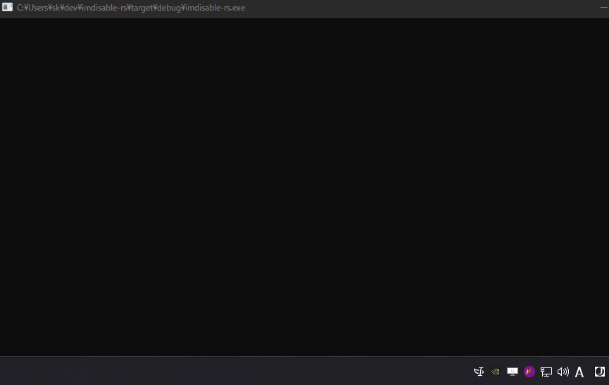

## `<C-[>`でIMEを無効化するやつ

[](https://crates.io/crates/imdisable)

Vimキーバインドで`C-[`したあとにｊｊｊｊｊｊｊｊｊとなるのがうざいため。



## Install

### Windows

```shell
cargo install imdisable
```

`~/.cargo/bin/imdisable.exe`をタスクスケジューラあたりに登録しておく。

### Linux

`fcitx5-remote` command required.

```shell
cargo install imdisable
sudo ln -sf $HOME/.cargo/bin/imdisable /usr/bin/imdisable
```

Run as user service (`~/.config/systemd/user/imdisable.service`).

```systemd
[Unit]
Description=imdisable

[Service]
Type=simple
ExecStart=/usr/bin/imdisable &
Restart=on-failure
StartLimitInterval=3
StartLimitBurst=100

[Install]
WantedBy=default.target
```

```shell
systemctl --user enable imdisable.service
```
